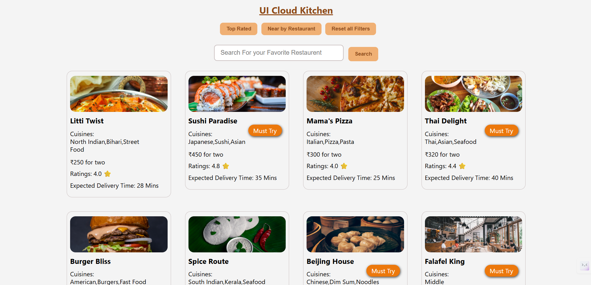

````markdown
# 🍽️ UI Cloud Kitchen - Restaurant Menu Card App

A modern, elegant React application that displays restaurant menu cards with integrated **search** and **filtering** functionality. Built to deliver a seamless, minimal UI inspired by real-world food delivery platforms.

---

## ✨ Features

- 🔍 **Search Functionality**  
  Quickly search restaurants by name using a responsive input field.

- ⭐ **Top Rated Filter**  
  One-click filter to show only restaurants with high ratings (e.g., 4.0+).

- 📍 **Nearby Filter**  
  Display restaurants within a short travel distance (e.g., < 5 kms).

- 🖼️ **Dynamic Restaurant Cards**  
  Each card displays:
  - Restaurant name
  - Thumbnail image
  - Cuisine types
  - Ratings & cost
  - Delivery time & offers

- 🚫 **No Results View**  
  Displays a 404-style image with a message when no restaurants match search or filters.

- 🎨 **Clean & Subtle UI**  
  Designed with a light, modern aesthetic using neutral background tones for an elegant user experience.

---

## 🛠️ Tech Stack

- ⚛️ **React.js** – Frontend framework
- 🟨 **JavaScript (ES6+)** – App logic and interactivity
- 🎨 **CSS / Tailwind CSS (optional)** – Customizable styling
- ⚡ **Vite (optional)** – Fast development tooling

---

## 🚀 Getting Started

### 1. Clone the repository

```bash
git clone https://github.com/yourusername/ui-cloud-kitchen.git
cd ui-cloud-kitchen
````

### 2. Install dependencies

```bash
npm install
```

### 3. Start the development server

```bash
npm start
```

Visit: `http://localhost:3000` to see the app in action.

---

## 🧠 Functional Overview

### 🔍 Search

Type a restaurant name into the search box and click "Search" to filter by name.

### ⭐ Top Rated Button

Click the "Top Rated" button to show restaurants with a rating of **4.0 or above**.

### 📍 Nearby Button

Click the "Nearby" button to filter restaurants with a **travel distance ≤ 5 kms**.

### 🧾 Display

All matching restaurants are shown as individual cards with key info:

* Image (from Cloudinary)
* Name, Cuisines
* Rating, Cost for two, Delivery time
* Discounts (if available)

### 🖼️ No Match Fallback

If no restaurants match, a 404-style message and image are shown.

---

## 📁 Project Structure

```
/components
  ├── Card.jsx            // Component to display restaurant card
  ├── mockData.js         // Restaurant mock data
App.jsx                   // Main component
index.css / App.css       // Styling files
404Page.jpg               // Not found image in public/
```

---

## 📸 Screenshot

[]

---

## ✅ Example Filters Logic (Simplified)

```js
// Top Rated
const topRated = resData.filter(res => parseFloat(res.data.avgRating) >= 4.0);

// Nearby
const nearby = resData.filter(res => res.data.lastMileTravel <= 5);
```

---

## 📄 License

This project is open-source and available under the [MIT License](LICENSE).

---

## 🙌 Acknowledgments

Inspired by modern UI patterns from Swiggy, Zomato, and other food-tech apps.

